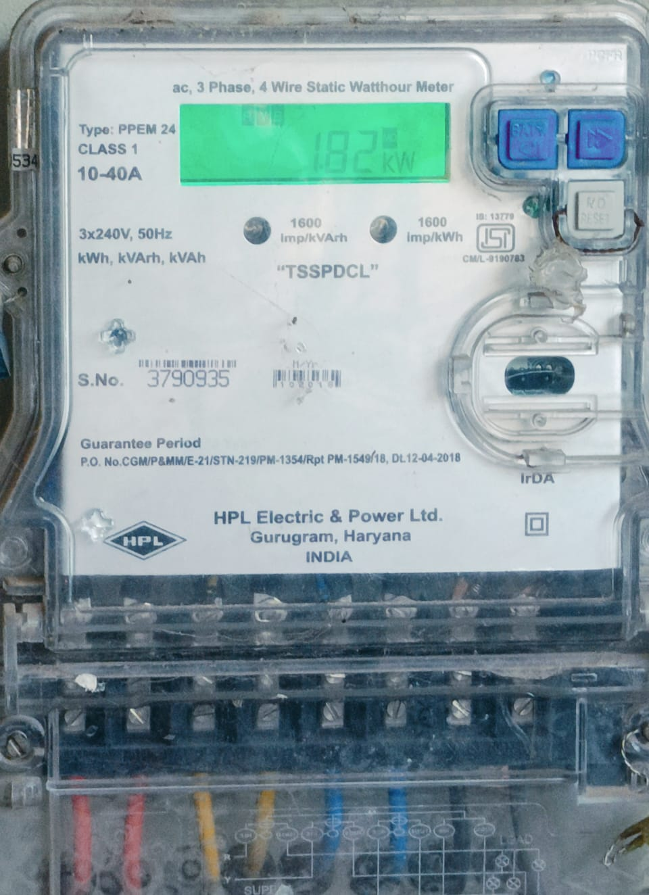
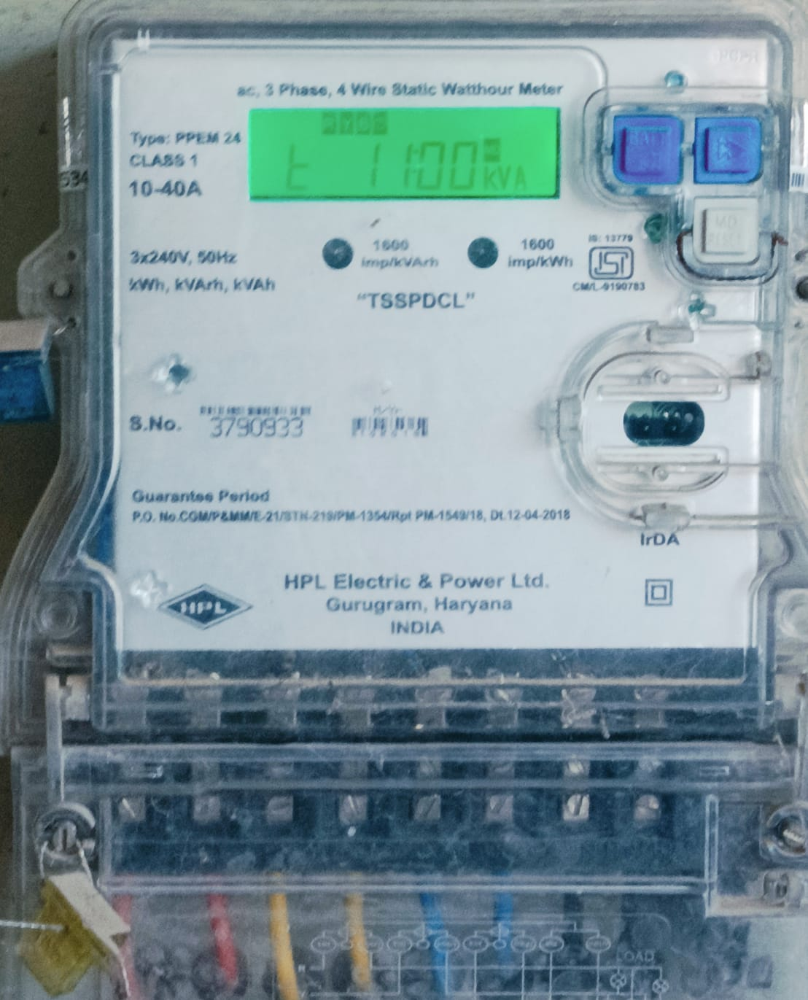
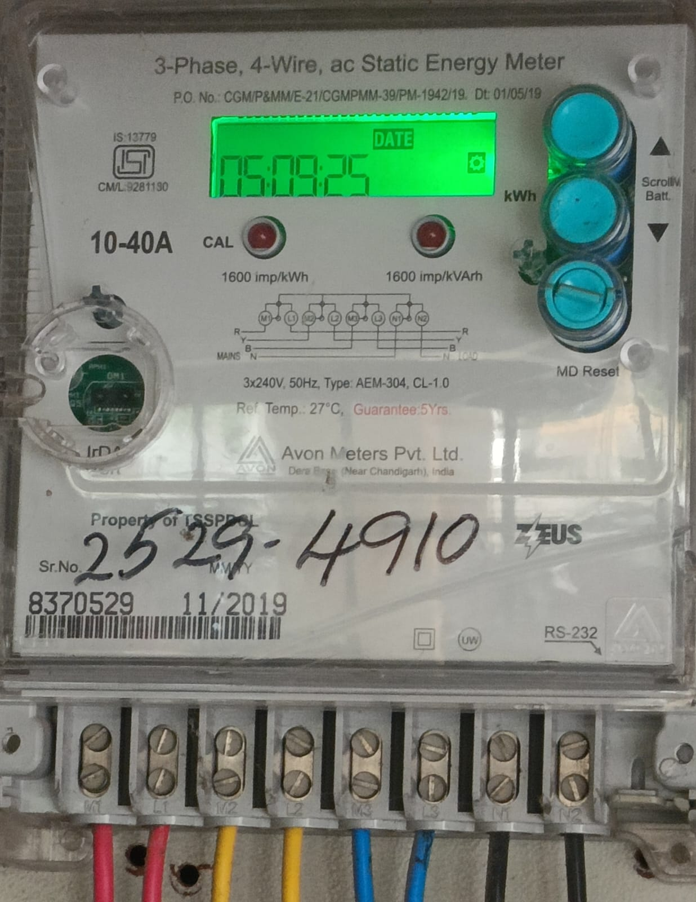

# 📟 METERS-PROJECT – Streamlit Meter Dashboard

A Streamlit-based dashboard for managing meter records with MongoDB integration.  
The app allows users to add meters, upload images, generate PDF reports, and browse meters with filtering & sorting.  
All images and generated reports are also saved locally inside the `outputs/` folder for easy access.

---

## Overview
This project demonstrates a **data management dashboard** where each meter record contains a Meter ID, Consumer ID, numeric reading, and an associated image.  
The app ensures case-insensitive uniqueness for IDs, provides PDF report downloads for each meter, and supports local file storage for demonstration purposes.

---

## Key Features
- Add new meter records with:
  - Meter ID, Consumer ID, Value (reading), and Image
- Prevent duplicate Meter/Consumer IDs
- Store images in MongoDB GridFS
- Save images and PDF reports to `outputs/`
- Browse, search, filter, and paginate through saved meters
- Update meter values in-place
- Delete meters (removes associated image from GridFS)
- Generate a styled **Meter Report PDF** for each record

---

## Tech Stack

| Layer        | Tools                                |
|--------------|--------------------------------------|
| Frontend     | Streamlit                            |
| Backend      | MongoDB Atlas, GridFS                |
| Reporting    | ReportLab / FPDF (PDF generation)    |
| Language     | Python                               |
| File Storage | Local `outputs/` folder for showcase |

---

## Output Screenshots

### Home Page


### Meters Page


### Meter Report PDF Preview


### Sample Meter Images
<p align="center">
  
  
  
</p>

---

## How to Run the Project

### Prerequisites
- Python 3.9+  
- MongoDB Atlas cluster (or local MongoDB instance)  
- Streamlit installed (`pip install -r requirements.txt`)

### Clone the repo
```bash
git clone https://github.com/ASHRITH-SAMBARAJU/METERS-PROJECT.git
