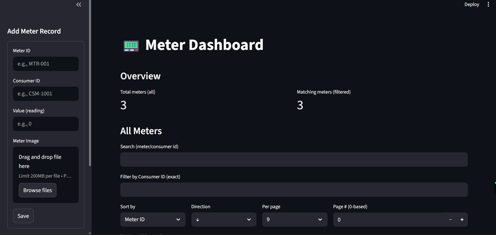
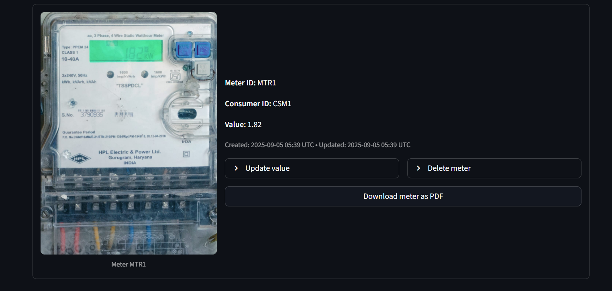
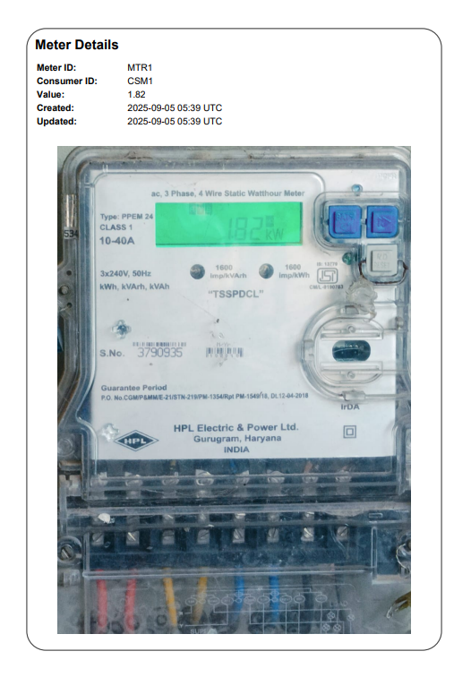

# METERS-PROJECT – Streamlit Based Meter Dashboard

A Streamlit-based dashboard for managing meter records with MongoDB integration.  
The app allows users to add meters, upload images, generate PDF reports, and browse meters with filtering & sorting.  

---

## Overview
This project demonstrates a **data management dashboard** where each meter record contains a Meter ID, Consumer ID, numeric reading, and an associated image.  
The app ensures case-insensitive uniqueness for IDs, provides PDF report downloads for each meter, and supports local file storage for demonstration purposes.

---

## Key Features
- Add new meter records with:
   * Meter ID
   * Consumer ID
   * Value (reading)
   * Meter Image
- Prevent duplicate Meter/Consumer IDs
- Store images in MongoDB GridFS
- Browse, search, filter, and paginate through saved meters
- Update meter values in-place
- Delete meters (removes associated image from GridFS)
- Generate a styled **Meter Report PDF** for each record

---

## Tech Stack

| Layer        | Tools                                |
|--------------|--------------------------------------|
| Frontend     | Streamlit                            |
| Backend      | MongoDB Atlas, GridFS                |
| Reporting    | ReportLab / FPDF (PDF generation)    |
| Language     | Python                               |

---

## Output Screenshots

### Home Page


### Meters Page


### Meter Report PDF Preview


---

## How to Run the Project

### Prerequisites
- Python 3.9+  
- MongoDB Atlas cluster (or local MongoDB instance)  
- Streamlit installed (`pip install -r requirements.txt`)

### Clone the repo
```bash
git clone https://github.com/ASHRITH-SAMBARAJU/METERS-PROJECT.git
```
### Run the Project
#### Activate Virtual Environment
```bash
 .\.venv\Scripts\activate
```
#### Run the Powershell
```bash
streamlit run app.py
```
---
## Contact Me

**Ashrith Sambaraju**  
Email: [ashrithsambaraju@gmail.com](mailto:ashrithsambaraju@gmail.com)  
LinkedIn: [linkedin.com/in/ashrithsambaraju](https://linkedin.com/in/ashrithsambaraju)  
